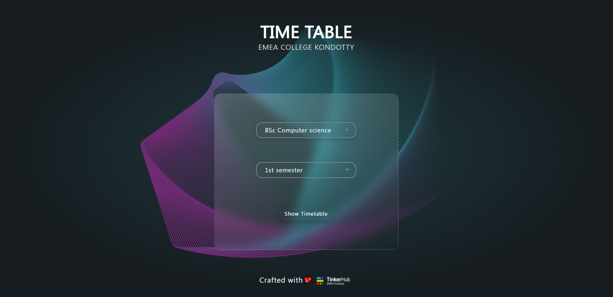
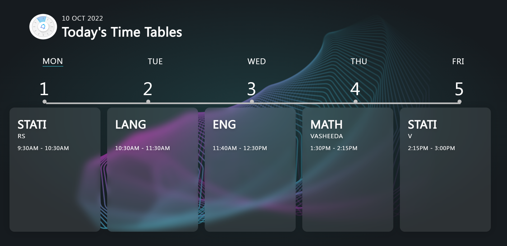

# EMEA Time Table App

This is a basiic web app developed by students of EMEA College which displays the time table of each and every department in EMEA College of Arts and Science, Kondotty.

# Screenshot

 
 

## Procedure

User will be welcomed by a login screen where he/she have to select their department and semester which they are in. The app will show their' current day's timetable. User also have an option to view other day's time tables.

## Aim

The ultimate aim of the web app is to bring all the classes in the college into a single spot. More options and features will be rolling out in future updates. We would like to integrate the following features,

- A portal for students to view their attendance details.
- A portal to analyse Students' academic perfomance.
- A portal where invite links of all the classes and seminars will be made available.
- Admin panel for teachers and Princpal.
- Facility to make announcements for the entire college or for a batch specifically.

### More updates will be rolling out soon, STAY TUNED..!
